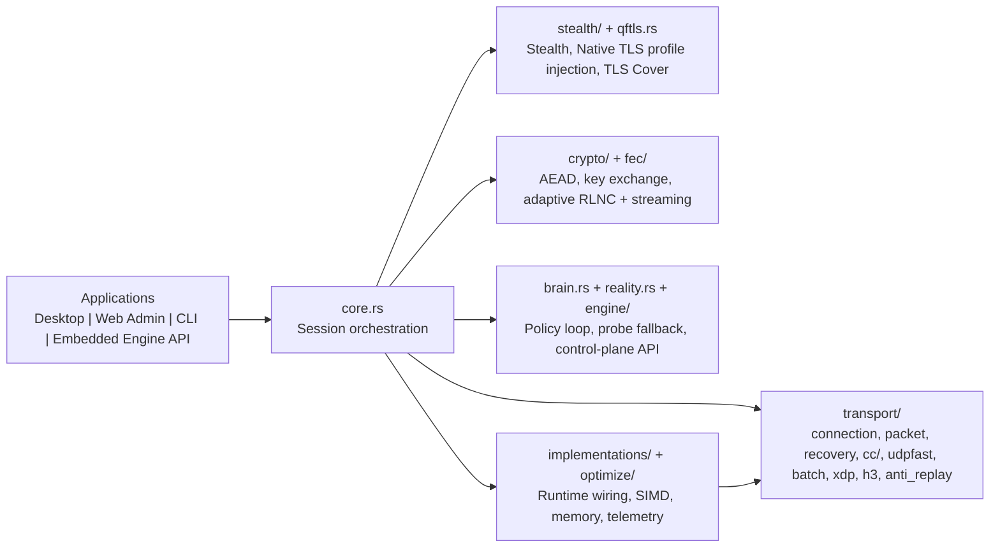

**Quick Links:** [Documentation](./docs/DOCUMENTATION.md) | [Contributing](./docs/CONTRIBUTING.md) | [Security](./SECURITY.md) | [Scripts Reference](./docs/DOCUMENTATION.md#scripts-reference) | [Configuration](./config/quicfuscate.toml) | [License](./docs/LICENSE)

<br><br>

<div align="center">
  

  [](https://github.com/Christopher-Schulze/QuicFuscate/actions)
  [](https://www.rust-lang.org/)
  [](https://datatracker.ietf.org/doc/html/rfc9000)
  [](https://en.wikipedia.org/wiki/HTTP/3)
  [](#stealth-techniques)
  [](#stealth-techniques)
  [](https://en.wikipedia.org/wiki/Forward_error_correction)
  [](https://en.wikipedia.org/wiki/AEGIS)
  [](https://en.wikipedia.org/wiki/MORUS_(cipher))
  [](https://en.wikipedia.org/wiki/SIMD)
</div>

---

## Table of Contents

- [Introduction](#introduction)
- [Highlights](#highlights)
- [Runtime Layer Model](#runtime-layer-model)
- [Core Features](#core-features)
  - [Stealth Techniques](#stealth-techniques)
  - [AEAD Cryptography](#next-gen-hardware-accelerated-aead-cryptography)
  - [Adaptive FEC](#adaptive-fec--recovery)
  - [StealthBrain](#adaptive-runtime-intelligence-stealthbrain)
  - [Control Plane](#server-authoritative-control-plane-qkey--admin-web)
  - [Performance Optimizations](#performance-optimizations)
- [Architecture Overview](#architecture-overview)
- [Project Status](#project-status)
  - [Surface Maturity](#surface-maturity)
  - [Feature Status Highlights](#feature-status-highlights)
  - [Security Review Fast Path](#security-review-fast-path)
  - [Quality Evidence Snapshot](#quality-evidence-snapshot)
  - [Code Layout](#code-layout)
- [Technical Specifications](#technical-specifications)
- [Build Instructions](#build-instructions)
  - [Rust Core](#rust-core)
  - [Web Admin UI](#web-admin-ui)
  - [Desktop App](#desktop-app)
  - [Running the Tests](#running-the-tests)
- [Command-Line Usage](#command-line-usage)
  - [Configuration](#configuration)
- [Continuous Integration](#continuous-integration)
- [Releases](#releases)
- [Contributing](#contributing)
- [License](#license)
- [Important Notice](#important-notice)

---

## Introduction
QuicFuscate is a stealth transport and VPN runtime built on a custom QUIC-based protocol with adaptive forward error correction and a multi-layered stealth stack. Designed for high-throughput, censorship-resistant operation with its own data-plane crypto, transport control, and stealth shaping - QuicFuscate is not a drop-in QUIC library or a standards-only optimization layer.

## Highlights
- Censorship-resistant runtime with browser-grade traffic observables
  (rustls-backed RealTLS, optional TLS Cover, HTTP/3/QPACK shaping, domain fronting, DoH, profile-coherent timing/padding; MASQUE and XOR are compatibility surfaces only)
- Adaptive SIMD dispatch (AVX2/AVX-512/NEON) with runtime CPU feature detection for optimal performance paths
- AEAD selection at runtime (`Aegis128L` family, `Morus1280_128`) with automatic CPU feature detection;
  PFS by default via ephemeral X25519 key exchange
- Hybrid FEC (Adaptive RLNC + Tetrys-like Streaming) with zero-overhead at 0% loss; escalates seamlessly under loss up to Wiedemann (GF(2^8), bitsliced, multi-U/block-BM with Rayon parallelization) and streaming burst (1 repair per N sources, partial-recovery toggle, SIMD-optimized GF(2^16) nibble paths)
- Zero-copy I/O with tunable memory pool and optional io_uring UDP fast path (Linux); AF_XDP support is experimental and opt-in behind `internal_af_xdp_experimental`
- Active-probe mitigation with detector-driven escalation and Reality fallback proxying to avoid protocol disclosure under active scans
- Adaptive StealthBrain control loop for ACK policy, timing/padding shaping, MASQUE preference hints, and FEC interval/redundancy hints
- HTTP/3 Server Push cover traffic with profile-coherent bursts and runtime intensity control during stealth escalation
- Adaptive payload compression (zstd policy engine) with optional dictionary paths and telemetry-backed decisioning
- Server-authoritative control plane: Admin Web/API issues and revokes QKeys; server-side enforcement applies embedded stealth/FEC policy at runtime
- Modular script suite: build/utils, test runners (incl. fuzz), benchmarks (Criterion, FEC CSV),
  TLS fingerprint verification, and in-tree tooling (no external quiche dependency)
- Desktop client policy is server-authoritative by design: Stealth/FEC policy comes from issued QKeys and is displayed in the client without local override drift

## Runtime Layer Model

QuicFuscate organizes its runtime into four explicit layers. This layering defines how the codebase is structured and read.

### 1. Canonical Runtime/Product Path
- real user-facing runtime behavior
- production contract: transport, stealth, FEC, and data-plane crypto
- examples:
  - `src/core.rs`
  - `src/transport/connection.rs`
  - `src/crypto/` production ciphers (`Aegis128L`, `Morus1280_128`)
  - `src/fec/` public API (`auto` / `off` modes)

### 2. Adaptive Policy/Control
- runtime control loops that decide how capability is applied
- examples:
  - `src/brain.rs`
  - `src/stealth/`
  - `src/fec/` continuous auto-controller and target/family logic

### 3. Platform Acceleration
- hardware detection, SIMD dispatch, Linux fast paths, and owner-local hot-path helpers
- examples:
  - `src/optimize/`
  - `src/simd.rs`
  - `src/optimize/udp.rs`
  - `src/optimize/uring_batch.rs`

### 4. Compat/Test/Experimental
- compatibility surfaces, test parity checks, and explicitly feature-gated experimental code
- examples:
  - internal AF_XDP experiment hooks
  - AF_XDP code behind `internal_af_xdp_experimental`
  - MASQUE compatibility surface
  - `rust-tests` / `benches` hooks

Rule of thumb:
- visible product/runtime behavior belongs to layer 1
- adaptive decisions belong to layer 2
- hardware and kernel specialization belong to layer 3
- compatibility and validation machinery belong to layer 4

## Core Features

### Stealth Techniques
- **Curated Browser Fingerprints**: Out-of-the-box deterministic in-memory ClientHello synthesis for curated browser/OS combinations (Chrome, Firefox, Safari, Edge), with no on-disk profile requirement for runtime operation<br>
- **Native TLS handshake profile injection + TLS Cover**: Applies native fingerprint-aligned TLS profiles and can emit a lightweight synthetic TLS Cover exchange for stealth traffic shaping<br>
- **Domain Fronting**: Masks traffic by routing through trusted CDN providers
  - Rotates across vetted provider domains to decouple the visible SNI from the true origin<br>
  - Risk/Tradeoff: effectiveness depends on current provider policy and regional filtering behavior<br>
- **HTTP/3 Masquerading**: Disguises traffic as standard HTTP/3 web traffic
  - Aligns ALPN, header sets, and framing to common web patterns<br>
- **MASQUE Tunneling**: HTTP/3 CONNECT-UDP/capsule surface (compatibility-only, disabled by default)
  - Available for explicit opt-in; not part of the default stealth runtime<br>
- **Traffic Obfuscation**: XOR-based obfuscation layer (compatibility-only, not part of the default runtime)
  - Sealed QUIC datagrams remain unmodified to preserve AEAD/FEC integrity<br>
- **TLS Profile Cache**: Generated ClientHello bytes are cached in memory for reuse across connections<br>
- **DNS-over-HTTPS (DoH)**: Resolves DNS via HTTPS to hide queries from on-path resolvers<br>
- **QPACK Header Shaping**: Encodes realistic HTTP/3 headers with QPACK for indistinguishable request patterns<br>
- **Active Probe Detection + Reality Fallback**: Detects probe-like traffic patterns and relays suspicious flows through a legitimate upstream path to preserve realistic network behavior under active scanning<br>
- **Server Push Cover Traffic**: Emits realistic HTTP/3 PUSH_PROMISE/DATA cover bursts with configurable intensity, base path, and burst interval for traffic-shaping realism<br>
- **Profile Cycling**: Optional rotation across browser/OS profiles on an interval to diversify observable fingerprints<br>
- **Cross-Layer Profile Coherence**: One active browser/OS profile coordinates TLS handshake injection, HTTP/3/QPACK shaping, MASQUE behavior, and fronting decisions for a homogeneous observable fingerprint<br>
- **Spin Bit Controls**: Configuration-level controls exist; runtime wiring is currently partial and intentionally gated

Native TLS handshake profile injection (RealTLS) is the primary handshake path and provides the cryptographic security layer.
TLS Cover is an optional lightweight synthetic exchange for stealth shaping and traffic realism - it does not replace native TLS security.
When TLS Cover is disabled, the stack uses native TLS handshake profile injection only.
Risk/Tradeoff: enabling TLS Cover adds cover-byte volume and processing overhead.

### Next-Gen Hardware-Accelerated AEAD Cryptography
- **AEGIS-128L**: Authenticated encryption with hardware acceleration when AES instructions are available<br>
- **AEGIS internal batching backends (`Aegis128X4` / `Aegis128X8`)**: internal AEGIS-128L implementation details selected automatically on AES hardware for throughput (x86_64 selects X8 when VAES batching is available, otherwise X4; aarch64 selects X4)<br>
- **MORUS-1280-128**: Authenticated encryption with a portable SIMD-friendly design for hosts without hardware AES<br>
- **Perfect Forward Secrecy**: ephemeral key exchange; past sessions remain safe if long-term keys leak<br>
- **Nonce Discipline & Constant-Time Glue**: Per-packet nonce handling and constant-time hot-path glue reduce side-channel exposure under load<br>
Runtime AEAD selection: `Aegis128L` when hardware AES is available, `Morus1280_128` otherwise. The dispatcher selects the best internal AEGIS backend automatically - `Aegis128X8` on x86_64 with VAES, `Aegis128X4` on x86_64 (AES-NI), `Aegis128X4` on aarch64 (AES+NEON). This is custom data-plane crypto, not a TLS cipher-suite claim. See "Cryptography Design" in ./docs/DOCUMENTATION.md.<br>
AEGIS-128L and MORUS-1280-128 are the production AEAD ciphers; the runtime selects hardware-accelerated backends where available. External crates serve as baseline vectors and differential oracles for validation, not as runtime providers.

### Adaptive FEC & Recovery
- **Hybrid RLNC + Streaming (Tetrys-like)**: Systematic sliding-window coding keeps source packets intact and emits repairs when the active window reaches the configured threshold<br>
- **SIMD GF Arithmetic**: Bit-sliced GF(2^8)/GF(2^16) cores with consistent byte widths across encoder/decoder and optional GF(2^16) nibble paths for high-throughput recovery<br>
- **Advanced Decoder Paths**: Sparse elimination (minimal-NNZ pivot), early repair recovery, and optional Wiedemann/block-BM acceleration for difficult loss patterns<br>
- **Adaptive Mode Switching**: Auto-Mode balances overhead versus delivery probability, keeps a zero-mode fast path at 0% loss, and enables burst-capable streaming under sustained loss/jitter<br>
- **Operational Controls**: Repair cadence (1 repair per N sources), partial recovery, and parallel repair generation are configurable; defaults and tuning are documented in the [FEC Operations Guide](./docs/DOCUMENTATION.md#fec-operations-guide)<br>
- **Outcome**: High stability on lossy/high-jitter paths with minimal overhead under clean network conditions

### Adaptive Runtime Intelligence (StealthBrain)
- **Telemetry-Driven Policy Engine**: Consumes ACK delay windows, ECN, delivery/loss dynamics, IAT/size divergence, and reorder signals to adapt transport and stealth behavior in real time<br>
- **ACK Policy Optimization**: Uses epsilon-greedy threshold selection with cooldowns and step limits to stabilize responsiveness without oscillation<br>
- **Cross-Layer Hints**: Emits timing, padding granularity, MASQUE preference, and FEC interval/redundancy hints for coordinated runtime adaptation<br>
- **Escalation Coordination**: Integrates probe-pressure signals with stealth escalation gates and cover-traffic behavior to keep observables coherent under stress

### Server-Authoritative Control Plane (QKey + Admin Web)
- **QKey Issuance & Revocation**: Admin Web/API manages server-issued QKeys with stable identifiers, token verification, and persistence controls<br>
- **Embedded Policy Enforcement**: Stealth/FEC policy from issued QKeys is enforced server-side at runtime (no client-side drift from authoritative policy)<br>
- **Operational Surface**: Admin endpoints expose status, configuration, and QKey operations while desktop clients consume issued keys for controlled connect/disconnect workflows

### Performance Optimizations
- **Runtime CPU Dispatch**: Central feature detection selects optimal SIMD/crypto paths per host (x86/ARM) with safe scalar fallback where required<br>
- **SIMD Acceleration**: ARM NEON and x86 AVX2/AVX-512 optimizations
  - Hot loops (FEC arithmetic, crypto glue) vectorized where safe for multi-Gbps throughput<br>
- **Bit-Sliced GF Multiplication**: Faster FEC arithmetic via dedicated AVX2/AVX512/NEON kernels
  - Field ops implemented with bit-slicing and tableless strategies to minimize cache pressure<br>
- **Vectorized XOR Fast Path**: 32-byte key path with runtime dispatch and safe scalar fallback for other sizes/alignments
- **Batched Processing**: QUIC I/O and FEC arithmetic are processed in cache-hot batches to maximize throughput<br>
- **Adaptive Compression (zstd Policy)**: Runtime compression decisions use payload size and link signals (RTT/loss/bandwidth), with optional dictionary-based paths and telemetry counters<br>
- **Zero-Copy Architecture**: Minimizes memory allocations for maximum throughput
  - Lock-free buffer pool with tunables `--pool-capacity` and `--pool-block`<br>
- **UDP Fast Path**: Portable batching (sendmmsg/recvmmsg), GSO/GRO (Linux), and optional io_uring path for reduced syscall overhead; experimental AF_XDP support behind `internal_af_xdp_experimental`<br>
- **Tunable Memory Pool**: Pre-allocated buffers for zero-copy I/O; adjust capacity/block size per workload<br>
- **Connection Multiplexing**: Multiple streams over a single connection<br>
- **0-RTT Handshake**: Reduced latency for subsequent connections; protected by a SHA-256 strike register (RFC 8446 Section 8) that rejects duplicate 0-RTT packets<br>
- **Telemetry Hooks**: Throughput, latency, and repair-efficiency counters expose operational tuning signals
- **Pluggable Congestion Control**: BBR3 (default), BBR2 (IETF draft-ietf-ccwg-bbr), and Reno with zero-vtable enum dispatch via `cc_dispatch!` macro. StealthShaper wraps any CC algorithm at runtime to apply browser-realistic gain patterns and pacing jitter during stealth mode

For a full technical deep dive (architecture, cryptography internals, FEC operations, telemetry, and deployment guidance), see [docs/DOCUMENTATION.md](./docs/DOCUMENTATION.md).

## Architecture Overview



## Project Status

The protocol core is entirely written in Rust, with companion desktop and web-admin applications under `apps/`.
Development focuses on hardening and operational validation across all runtime surfaces.

### Surface Maturity
- **Protocol core (`src/`)**: production runtime under active hardening and validation.
- **Desktop app (`apps/svelte-desktop` + `apps/tauri/src-tauri`)**: Svelte 5 desktop UI with native Tauri runtime bridge. Under active development with test-driven validation.
- **Web admin (`apps/svelte-admin`)**: Svelte 5 admin and control panel with full test coverage. Under active development with test-driven validation.
- **Shared packages (`packages/ui`, `packages/theme`)**: reusable Svelte 5 components and CSS tokens shared between desktop and admin UIs.

### Feature Status Highlights
- **UDP/io_uring fast path**: active
- **AF_XDP socket code (`internal_af_xdp_experimental`)**: experimental/internal only

### Development and Review Transparency
- Security-sensitive changes land with explicit runtime validation or fail-closed behavior, with matching documentation updates in `docs/DOCUMENTATION.md`.
- Public feature claims use these states:
  - `active`: part of the production runtime
  - `compat-only`: available for compatibility but not the primary runtime
  - `experimental/internal`: present behind explicit internal feature gates or test-only boundaries
  - `deprecated`: kept only for migration away from an older contract

### Reviewer Truth Snapshot
- Runtime correctness is defined by checked-in code, targeted tests, and audit scripts.
- Custom data-plane crypto with in-tree implementations:
  - product contract: `Aegis128L`, `Morus1280_128`
  - internal backend machine room: `Aegis128X4`, `Aegis128X8`
- The Linux high-performance send path is `io_uring` (SQPOLL + `SendMsgZc` zero-copy auto-probed; inbound via `RecvMsg` + eventfd bridge).
- Zero-copy is achieved via `io_uring SendMsgZc` (not `MSG_ZEROCOPY`/`SO_ZEROCOPY`).
- busy-poll socket tuning is not used.

### Security Review Fast Path
- Suggested skeptical review order:
  1. `Reviewer Truth Snapshot`
  2. `docs/DOCUMENTATION.md` -> `Security Review Boundary Map`
  3. `docs/DOCUMENTATION.md` -> `Runtime Complexity Layer Model`
  4. Proof surfaces listed below
- Review-oriented boundary map: `docs/DOCUMENTATION.md` -> `Security Review Boundary Map`
- Runtime layer map: `docs/DOCUMENTATION.md` -> `Runtime Complexity Layer Model`
- Data-plane AEAD proof surfaces:
  - `scripts/tests/rust/rt-security-suite.rs`
  - `scripts/tests/rust/rt-property-suite.rs`
  - `scripts/tests/fuzz/fuzz_targets/crypto_operations.rs`
- Retained backend evidence:
  - `scripts/benchmarks/suites/bench-retained-crypto-backends.sh`
- Runtime/FEC evidence:
  - `scripts/tests/suites/test-runtime-soak-chaos.sh`
  - `scripts/tests/suites/test-fec-auto-controller-proof.sh`
- Runtime/docs contract drift gate:
  - `scripts/tests/audits/audit-runtime-guardrails.sh`

### Quality Evidence Snapshot
- Tested:
  - targeted rust-tests in `scripts/tests/rust/`
  - property checks in `scripts/tests/rust/rt-property-suite.rs`
- Fuzzed:
  - crypto/runtime fuzz targets in `scripts/tests/fuzz/fuzz_targets/`
- Audited:
  - `scripts/tests/audits/audit-runtime-guardrails.sh`
- Soak- and chaos-checked:
  - `scripts/tests/suites/test-runtime-soak-chaos.sh`
  - `scripts/tests/suites/test-fec-auto-controller-proof.sh`
- Bench-evidenced:
  - `scripts/benchmarks/suites/bench-retained-crypto-backends.sh`
- Limits:
  - this evidence demonstrates regression resistance and contract consistency
  - it does not substitute formal verification or external security review

### Code Layout
QuicFuscate uses a modular, consolidated layout:
- `src/core.rs` (QUIC session and I/O), `src/crypto/` (AEAD and handshake glue),
- `src/fec/` (encoder/decoder/adaptive/GF tables),
- `src/stealth/` (DoH, HTTP/3 masquerading, TLS Cover, fingerprinting, domain fronting, QPACK helpers, active-probe detection, server-push cover runtime controls).
- `src/reality.rs` (probe-time fallback proxying that preserves realistic upstream responses under active scanning).
- `src/qftls.rs` (unified RealTLS rustls provider + optional TLS Cover orchestration).
- `src/engine/` (embedded control plane API: lifecycle, commands/events, stats, runtime orchestration).
- `src/implementations/` (client/server runtime wiring, admin HTTP, QKey registry, platform integration).
- `src/optimize/` (CPU/SIMD dispatch, memory/telemetry/perf-focused acceleration modules).
The project is built as a single Rust crate that exposes a library and one CLI binary (`quicfuscate` with `client` and `server` subcommands).
The transport subsystem uses `src/transport.rs` as the module root and focused submodules under `src/transport/` (`connection.rs`, `packet.rs`, `frames.rs`, `recovery.rs`, `udpfast.rs`, `batch.rs`, `config.rs`, `pn.rs`, `h3.rs`, `anti_replay.rs`, `xdp.rs`, `cc/`). The `cc/` directory contains the pluggable congestion control trait and implementations (`reno.rs`, `bbr2.rs`, `bbr3.rs`, `stealth_shaper.rs`). The io_uring batch sender lives in `src/optimize/uring_batch.rs` (feature-gated, Linux-only).

## Technical Specifications

| Component           | Technology                                                                 |
|---------------------|----------------------------------------------------------------------------|
| Transport Protocol  | Forked QUIC-like transport with HTTP/3/TLS cover surfaces                  |
| Encryption          | AEGIS-128L family, MORUS-1280-128                                          |
| Key Exchange        | X25519 (ephemeral); Perfect Forward Secrecy by default                      |
| Error Correction    | Hybrid Adaptive FEC (RLNC + Streaming)                                     |
| Stealth/Obfuscation | rustls-backed RealTLS, optional TLS Cover, HTTP/3/QPACK shaping, domain fronting, DoH, adaptive padding/timing/protocol mimicry, active-probe detection + Reality fallback, server-push cover traffic; MASQUE and XOR are compatibility-only |
| Adaptive Intelligence | StealthBrain policy engine (ACK/timing/padding/FEC coordination plus compatibility-only MASQUE hinting) |
| Control Plane       | Server-authoritative QKey lifecycle (issue/revoke/persist), Admin Web/API policy enforcement |
| Compression         | Adaptive zstd policy (signal-aware compression decisions, optional dictionary path) |
| Platforms           | Linux, macOS, Windows                                                      |
| Architecture        | x86_64, ARM64                                                              |
| Performance         | High-throughput, hardware-adaptive fast paths (SIMD + batching + zero-copy) |

## Build Instructions

The Rust protocol core builds with pure Cargo. No external C toolchains, vendored libraries or `QUICHE_PATH` are required for the core build.
For local validation builds, run the Rust core workflow and both app workflows.

### Rust core

Build the crate using Cargo:

```bash
# Debug build
cargo build

# Optimized release build
cargo build --release
```

### Web Admin UI

```bash
cd apps/svelte-admin
bun install
bun run check
bun run build
```

### Desktop App

```bash
cd apps/svelte-desktop
bun install
bun run check
bun run build

# Optional native bundle/signing pipeline step via the Tauri host wrapper
cd ../tauri
bun run tauri build
```

QuicFuscate works out of the box with deterministic in-memory ClientHello synthesis for curated browser/OS profiles. External `.chlo`/`.chlo.b64` dumps under `browser_profiles/` are optional and intended for audit/regression workflows.

### Running the tests

Execute the test suite with Cargo:

```bash
# Default suite (1150+ lib tests)
cargo test

# Extended suite with additional integration test paths
cargo test --features rust-tests
```

Troubleshooting:
- If a build fails, detailed logs (from build script hooks) can be found under `scripts/out/<category>/`.
- All scripts in `scripts/*` provide a unified minimal help handler via `-h`, `--help`, or `help`. It prints `Usage: <script>` and the first `# Description:` line, then exits with code `0` without side effects.

## Command-Line Usage

The single binary `quicfuscate` provides two user-facing subcommands: `client` and `server`.

Show help:

```bash
quicfuscate --help
quicfuscate client --help
quicfuscate server --help
```

Global flags:

```
  -v, --verbose          Enable verbose logging
      --telemetry        Enable telemetry snapshot on 127.0.0.1:9898 by default (GET /telemetry)
```
Runtime behavior can be tuned via CLI flags and `QUICFUSCATE_*` environment variables.

Top runtime environment variables (quick reference):

```
  QUICFUSCATE_METRICS_ADDR         Telemetry bind address (default 127.0.0.1:9898)
  QUICFUSCATE_STEALTH_MODE         Stealth baseline (off|performance|stealth|anti-dpi|intelligent|manual); "base" is an alias for "performance"
  QUICFUSCATE_TLS_COVER            TLS Cover provider gate (0|1)
  QUICFUSCATE_USE_TLS_COVER_EXTRAS TLS Cover extras gate in StealthManager (0|1)
  QUICFUSCATE_FEC_STREAM_EVERY     Streaming FEC cadence override
  QUICFUSCATE_FASTPATH             Transport fast path policy (auto|off)
  QUICFUSCATE_RAYON_THREADS        Parallel worker cap for FEC paths
  QUICFUSCATE_DESKTOP_UPDATER_ACTIVE Desktop updater runtime activation gate
```

Full environment-variable reference: [docs/DOCUMENTATION.md - Configuration Reference (Full)](./docs/DOCUMENTATION.md#configuration-reference-full).

#### Configuration

Full, commented configuration: see `./config/quicfuscate.toml`.

Typical client example:

```bash
quicfuscate client \
  --remote 203.0.113.1:4433 \
  --local 127.0.0.1:1080 \
  --profile chrome \
  --cc-algorithm bbr3 \
  --front-domain cdn.example.com \
  --verify-peer \
  --config ./config/quicfuscate.toml
```
Enable `--telemetry` to expose a telemetry snapshot on 127.0.0.1:9898 by default (GET /telemetry).
Override bind address via `QUICFUSCATE_METRICS_ADDR`.

Typical server example:

```bash
quicfuscate server \
  --listen 0.0.0.0:4433 \
  --cert ./server.crt \
  --key ./server.key \
  --profile firefox \
  --os linux \
  --cc-algorithm bbr3 \
  --config ./config/quicfuscate.toml
```

Important flags (selection):

```
  --no-utls               Disable uTLS and use regular TLS
  --verify-peer           Validate the server certificate
  --ca-file <path>        CA file for verification (client only)
  --debug-tls             Enable TLS trace diagnostics (via QUICFUSCATE_TRACE_TLS; keylog export is not available)
  --list-fingerprints     List built-in browser/OS fingerprint profiles (runtime-ready, no external dump required)
  --fec-mode <mode>       FEC mode (auto|off)
  --fec-config <path>     Load Adaptive FEC settings from TOML
  --doh-provider <url>    Custom DNS-over-HTTPS resolver
  --front-domain <d>      Domain used for fronting (repeatable or comma-separated)
  --disable-doh           Disable DNS over HTTPS
  --disable-fronting      Disable domain fronting
  --disable-http3         Disable HTTP/3 masquerading
  --profile-seq <list>    Comma-separated browser@os to cycle (e.g., chrome@windows,firefox@linux)
  --profile-interval <s>  Interval in seconds for profile switching
  --cc-algorithm <alg>    Congestion control: reno|bbr2|bbr3 (default: bbr3)
```

FEC mode mapping note:
- CLI `--fec-mode` accepts canonical values (`auto|off`).
- In config/admin/QKey policy surfaces, canonical values are `auto` and `off`; legacy aliases normalize to `auto` during migration.

## Continuous Integration

GitHub Actions build and test the project on Linux, macOS and Windows. CI runs:
- Rust: `cargo clippy --workspace --all-targets`, `cargo build --release`, `cargo test --workspace --all-targets` (Linux, macOS, Windows)
- Rust feature matrix: `cargo test --features <feature>` for rust-tests, simd-selfcheck, io_uring combinations
- Svelte: `bun run check`, `bun run test:unit`, `bun run test:e2e` for `apps/svelte-admin` and `apps/svelte-desktop`
- Clippy feature matrix: multiple feature combinations (unsafe_rust, simd-selfcheck, internal_wiedemann, io_uring) via `.github/workflows/clippy-matrix.yml`

See `.github/workflows/ci.yml` and `.github/workflows/clippy-matrix.yml` for the full workflows. To reproduce CI-specific static checks locally run:

```bash
cargo clippy --workspace --all-targets -- -D warnings
```

## Releases

This project is published as a source-first open-source release.
Users build from source using the documented Rust and Bun workflows.

Signed binary distribution and automatic updates are not part of the current source-first release scope.
They require signing credentials and CI secret management to be available.

Desktop updater behavior in this release:
- Integrated but disabled by default.
- Runtime activation gate: `QUICFUSCATE_DESKTOP_UPDATER_ACTIVE=true`.
- Keep disabled for source-first release builds without signed artifacts.

Binary distribution requirements:
- A signing and notarization pipeline is required (macOS/Windows, optional Linux package signing).
- Updater activation in shipped builds requires end-to-end verified signature validation.
- Signed release assets and update metadata are published through GitHub Releases.

Security and hardening references for this release:
- Release security audit snapshot, threat model, and deployment hardening guide: `docs/DOCUMENTATION.md`
- Release scope and distribution policy: [Release Scope](./docs/DOCUMENTATION.md#release-scope)
- Architecture and release wiring map: `docs/MAP.md`

Known limitations in this source-first release:
- No signed desktop binaries are shipped yet.
- Desktop updater remains disabled by default until signed artifacts are available.

Release packaging helper:
```bash
./scripts/utils/util-release-source-package.sh
```
This creates a clean source archive under `scripts/out/releases/source/` and excludes transient artifacts.

## Contributing

We welcome contributions from the community. Please read our guidelines before opening an issue or pull request:

- Start here: [CONTRIBUTING.md](./docs/CONTRIBUTING.md)
- Follow the consolidated module layout (`src/core.rs`, `src/crypto/`, `src/fec/`, `src/stealth/`) and keep documentation changes in `docs/DOCUMENTATION.md`
- Ensure CI, linters, and the static hardening audit pass locally before proposing changes
- Update `config/quicfuscate.toml` and user-facing docs when behavior or flags change

## License

This project is licensed under the MIT License. You are free to use, copy, modify, merge, publish, distribute, sublicense, and/or sell copies of the Software, subject to the terms of the MIT License. 

See [LICENSE](./docs/LICENSE) for details.

## Important Notice

This software is provided "as is" without any warranties. The developers assume no responsibility for any damage caused by the use of this software. Use at your own risk.
